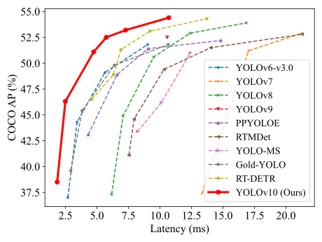
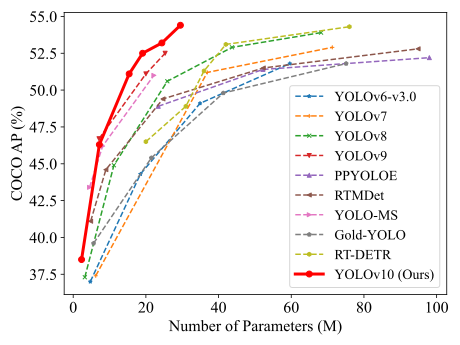

# [YOLOv10: Real-Time End-to-End Object Detection](https://arxiv.org/abs/2405.14458)


Official PyTorch implementation of **YOLOv10**.

<p align="center">
  
   <br>
  Comparisons with others in terms of latency-accuracy (left) and size-accuracy (right) trade-offs.
</p>

[YOLOv10: Real-Time End-to-End Object Detection](https://arxiv.org/abs/2405.14458).\
Ao Wang, Hui Chen, Lihao Liu, Kai Chen, Zijia Lin, Jungong Han, and Guiguang Ding\
[](https://arxiv.org/abs/2405.14458) <a href="https://colab.research.google.com/github/roboflow-ai/notebooks/blob/main/notebooks/train-yolov10-object-detection-on-custom-dataset.ipynb#scrollTo=SaKTSzSWnG7s"></a>  [](https://huggingface.co/spaces/kadirnar/Yolov10)   [](https://huggingface.co/spaces/Xenova/yolov10-web)

<details>
  <summary>
  <font size="+1">Abstract</font>
  </summary>
Over the past years, YOLOs have emerged as the predominant paradigm in the field of real-time object detection owing to their effective balance between computational cost and detection performance. Researchers have explored the architectural designs, optimization objectives, data augmentation strategies, and others for YOLOs, achieving notable progress. However, the reliance on the non-maximum suppression (NMS) for post-processing hampers the end-to-end deployment of YOLOs and adversely impacts the inference latency. Besides, the design of various components in YOLOs lacks the comprehensive and thorough inspection, resulting in noticeable computational redundancy and limiting the model's capability. It renders the suboptimal efficiency, along with considerable potential for performance improvements. In this work, we aim to further advance the performance-efficiency boundary of YOLOs from both the post-processing and the model architecture. To this end, we first present the consistent dual assignments for NMS-free training of YOLOs, which brings the competitive performance and low inference latency simultaneously. Moreover, we introduce the holistic efficiency-accuracy driven model design strategy for YOLOs. We comprehensively optimize various components of YOLOs from both the efficiency and accuracy perspectives, which greatly reduces the computational overhead and enhances the capability. The outcome of our effort is a new generation of YOLO series for real-time end-to-end object detection, dubbed YOLOv10. Extensive experiments show that YOLOv10 achieves the state-of-the-art performance and efficiency across various model scales. For example, our YOLOv10-S is 1.8$\times$ faster than RT-DETR-R18 under the similar AP on COCO, meanwhile enjoying 2.8$\times$ smaller number of parameters and FLOPs. Compared with YOLOv9-C, YOLOv10-B has 46\% less latency and 25\% fewer parameters for the same performance.
</details>

**UPDATES** 🔥
- 2024/05/27: Thanks to [sujanshresstha](sujanshresstha) for the integration with [DeepSORT](https://github.com/sujanshresstha/YOLOv10_DeepSORT.git)!
- 2024/05/27: We have updated the [checkpoints](https://github.com/THU-MIG/yolov10/releases/tag/v1.1) with other attributes, like class names, for ease of use.
- 2024/05/26: Thanks to [CVHub520](https://github.com/CVHub520) for the integration into [X-AnyLabeling](https://github.com/CVHub520/X-AnyLabeling)!
- 2024/05/26: Thanks to [DanielSarmiento04](https://github.com/DanielSarmiento04) for integrate in [c++ | ONNX | OPENCV](https://github.com/DanielSarmiento04/yolov10cpp)!
- 2024/05/25: Add [Transformers.js demo](https://huggingface.co/spaces/Xenova/yolov10-web) and onnx weights(yolov10[n](https://huggingface.co/onnx-community/yolov10n)/[s](https://huggingface.co/onnx-community/yolov10s)/[m](https://huggingface.co/onnx-community/yolov10m)/[b](https://huggingface.co/onnx-community/yolov10b)/[l](https://huggingface.co/onnx-community/yolov10l)/[x](https://huggingface.co/onnx-community/yolov10x)). Thanks to [xenova](https://github.com/xenova)!
- 2024/05/25: Add [colab demo](https://colab.research.google.com/github/roboflow-ai/notebooks/blob/main/notebooks/train-yolov10-object-detection-on-custom-dataset.ipynb#scrollTo=SaKTSzSWnG7s), [HuggingFace Demo](https://huggingface.co/spaces/kadirnar/Yolov10), and [HuggingFace Model Page](https://huggingface.co/kadirnar/Yolov10). Thanks to [SkalskiP](https://github.com/SkalskiP) and [kadirnar](https://github.com/kadirnar)! 

## Performance
COCO
| Model | Test Size | #Params | FLOPs | AP<sup>val</sup> | Latency |
|:---------------|:----:|:---:|:--:|:--:|:--:|
| [YOLOv10-N](https://github.com/THU-MIG/yolov10/releases/download/v1.1/yolov10n.pt) |   640  |     2.3M    |   6.7G   |     38.5%     | 1.84ms |
| [YOLOv10-S](https://github.com/THU-MIG/yolov10/releases/download/v1.1/yolov10s.pt) |   640  |     7.2M    |   21.6G  |     46.3%     | 2.49ms |
| [YOLOv10-M](https://github.com/THU-MIG/yolov10/releases/download/v1.1/yolov10m.pt) |   640  |     15.4M   |   59.1G  |     51.1%     | 4.74ms |
| [YOLOv10-B](https://github.com/THU-MIG/yolov10/releases/download/v1.1/yolov10b.pt) |   640  |     19.1M   |  92.0G |     52.5%     | 5.74ms |
| [YOLOv10-L](https://github.com/THU-MIG/yolov10/releases/download/v1.1/yolov10l.pt) |   640  |     24.4M   |  120.3G   |     53.2%     | 7.28ms |
| [YOLOv10-X](https://github.com/THU-MIG/yolov10/releases/download/v1.1/yolov10x.pt) |   640  |     29.5M    |   160.4G   |     54.4%     | 10.70ms |

## Installation
`conda` virtual environment is recommended. 
```
conda create -n yolov10 python=3.9
conda activate yolov10
pip install -r requirements.txt
pip install -e .
```

## Validation
[`yolov10n.pt`](https://github.com/THU-MIG/yolov10/releases/download/v1.1/yolov10n.pt)  [`yolov10s.pt`](https://github.com/THU-MIG/yolov10/releases/download/v1.1/yolov10s.pt)  [`yolov10m.pt`](https://github.com/THU-MIG/yolov10/releases/download/v1.1/yolov10m.pt)  [`yolov10b.pt`](https://github.com/THU-MIG/yolov10/releases/download/v1.1/yolov10b.pt)  [`yolov10l.pt`](https://github.com/THU-MIG/yolov10/releases/download/v1.1/yolov10l.pt)  [`yolov10x.pt`](https://github.com/THU-MIG/yolov10/releases/download/v1.1/yolov10x.pt)  
```
yolo val model=yolov10n/s/m/b/l/x.pt data=coco.yaml batch=256
```

## Training 
```
yolo detect train data=coco.yaml model=yolov10n/s/m/b/l/x.yaml epochs=500 batch=256 imgsz=640 device=0,1,2,3,4,5,6,7
```

## Prediction
```
yolo predict model=yolov10n/s/m/b/l/x.pt
```

## Export
```
# End-to-End ONNX
yolo export model=yolov10n/s/m/b/l/x.pt format=onnx opset=13 simplify
# Predict with ONNX
yolo predict model=yolov10n/s/m/b/l/x.onnx

# End-to-End TensorRT
yolo export model=yolov10n/s/m/b/l/x.pt format=engine half=True simplify opset=13 workspace=16
# Or
trtexec --onnx=yolov10n/s/m/b/l/x.onnx --saveEngine=yolov10n/s/m/b/l/x.engine --fp16
# Predict with TensorRT
yolo predict model=yolov10n/s/m/b/l/x.engine
```

## Acknowledgement

The code base is built with [ultralytics](https://github.com/ultralytics/ultralytics) and [RT-DETR](https://github.com/lyuwenyu/RT-DETR).

Thanks for the great implementations! 

## Citation

If our code or models help your work, please cite our paper:
```BibTeX
@misc{wang2024yolov10,
      title={YOLOv10: Real-Time End-to-End Object Detection}, 
      author={Ao Wang and Hui Chen and Lihao Liu and Kai Chen and Zijia Lin and Jungong Han and Guiguang Ding},
      year={2024},
      eprint={2405.14458},
      archivePrefix={arXiv},
      primaryClass={cs.CV}
}
```
